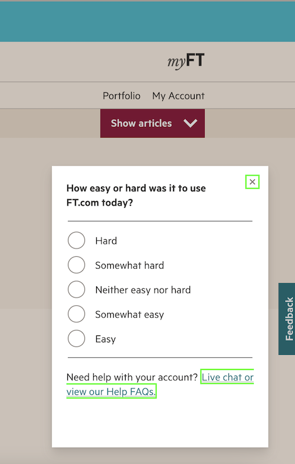

# n-feedback
Displays a feedback button when clicked, allows you to fill in a form with feedback questions.

## Demo
```sh
make install
make demo
```
Go to [http://local.ft.com:5005/](http://local.ft.com:5005/)



## Test locally in other apps
Use npm link to test the dependency locally

```sh
cd ~/n-feeback 
npm link
cd ~/some-next-app
npm link n-feedback        
```

## Usage

```
npm install --save @financial-times/n-feedback
```

Use handlebars template
```
{{ > n-feedback/templates/feedback-container}}
```
## Deployment

Create a release tag [in Github](https://github.com/Financial-Times/n-feedback/releases) following the Semver convention and prefixing the release number with `v`. This will make this available as a NPM package at that version.

If you are wanting to deploy to FT.com, after creating the tag you will need to coordinate the release for [these repos](https://github.com/search?q=org%3AFinancial-Times+filename%3Apackage.json+n-feedback&type=Code). You should create a pull request updating the package version in the repo's `package.json`.

## Execute test

```sh
make test        
```

